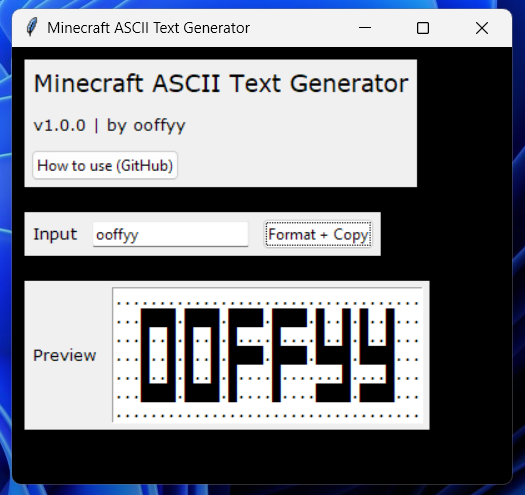
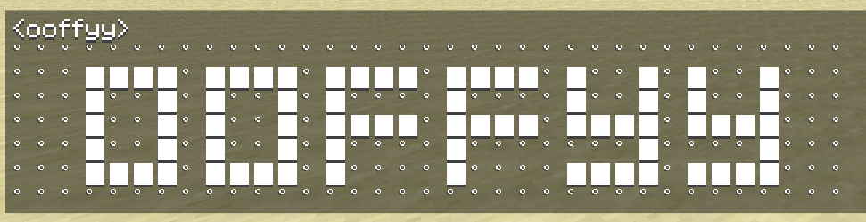

## Minecraft ASCII Text Generator

 

## Download

**Releases: https://github.com/realooffyy/Minecraft-ASCII-Text-Generator/releases**  
If you get blocked by SmartScreen, press `More info` -> `Run anyways`

## How to use

1. Type text you want to create in the `Input` box.
2. Click the `Format + Copy` button. This copies the text to your clipboard and shows you a preview.

> [!NOTE]
> The text will only show correctly on **Minecraft 1.11-**, or on **Minecraft 1.8.9** with [Patcher](https://sk1er.club/mods/patcher)'s "1.11 Chat Length" feature enabled. 

## Credits
- Converted with [Auto PY to EXE](https://github.com/brentvollebregt/auto-py-to-exe)

## Compiling with Auto PY to EXE
i made this mainly for myself
- Set script location to `main.py`
- Select `One File` and `Window Based (hide this console)`
- Set icon to `icon.ico`
- Additional files:
    - `const.py`
    - `format_input.py`
    - `icon.ico`
    - `utils.py`
    - `window.py`
- Additional folders:
    - `characters/`
